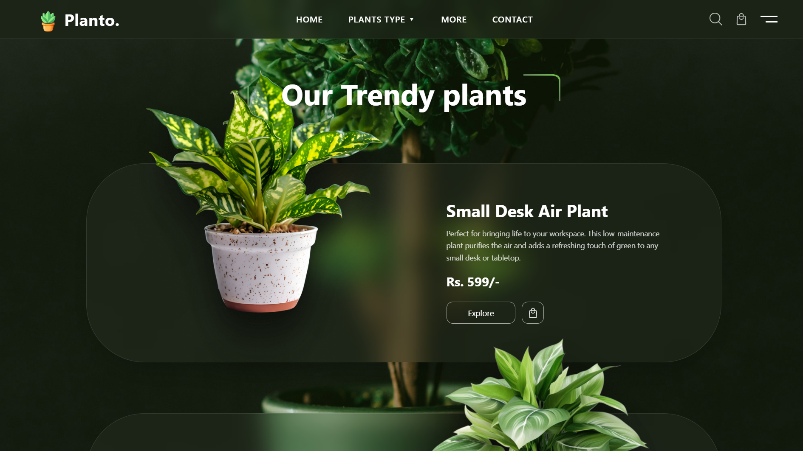
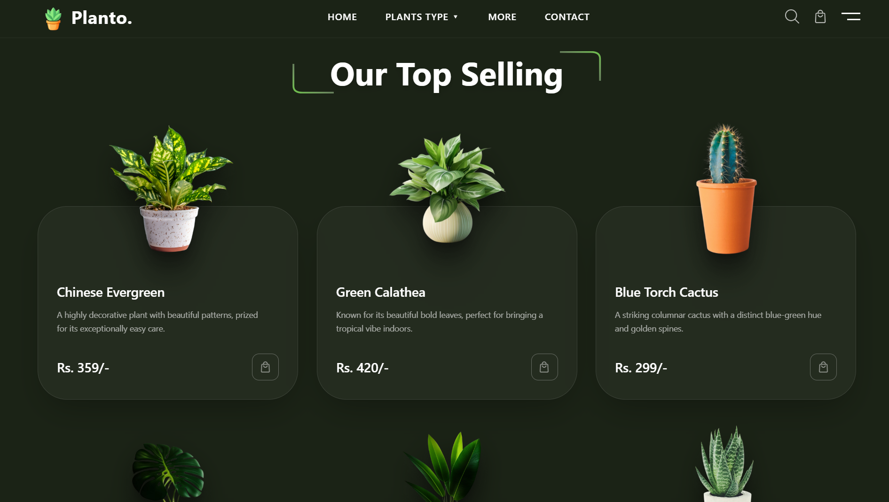
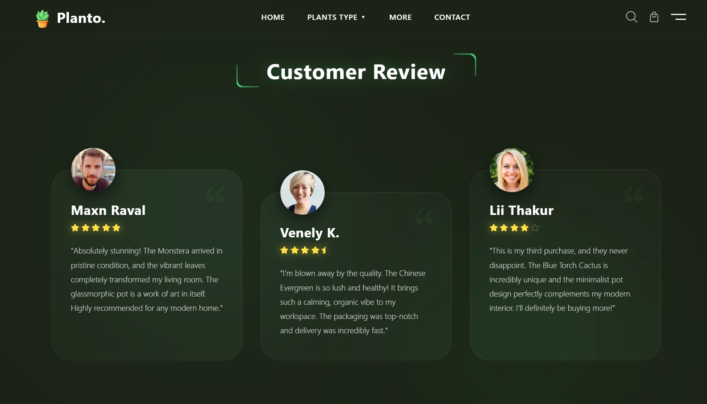
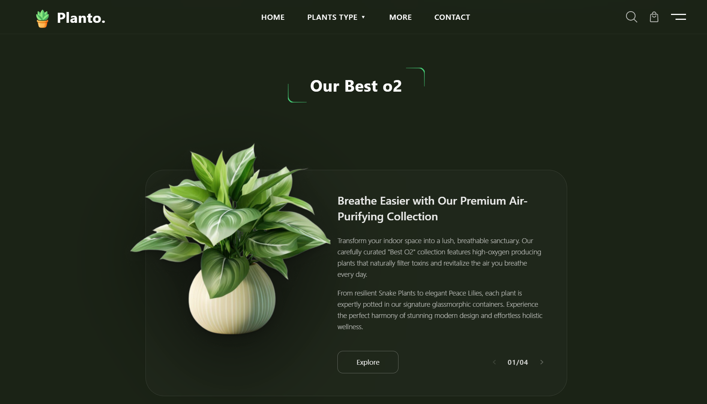
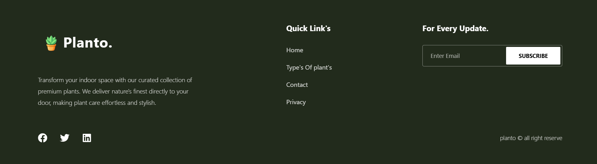

# Planto UI 🌿

A cinematic premium plant e-commerce landing page engineered with modern frontend architecture, immersive glassmorphism, fluid motion systems, and responsive visual storytelling.

Designed to simulate a luxury digital storefront experience with layered atmospherics, cinematic lighting, floating UI compositions, and polished micro-interactions.

---

## ✨ Preview

### Hero Section

Dark cinematic atmosphere with floating product cards, volumetric glow, and glassmorphism overlays.


---

### Trendy Plants

Featured floating product showcase with layered blur backgrounds and premium product emphasis.



---

### Top Selling Products

Reusable responsive product card system with hover interactions and glass effects.



---

### Customer Reviews

Soft elevated testimonial cards with staggered responsive layouts and subtle depth transitions.



---

### Best O2 Plants

Interactive cinematic featured section highlighting premium plant collections.



---

### Footer

Minimal premium footer with newsletter subscription and navigation hierarchy.



---

# 🚀 Live Demo

### 🔗 [View Live Website](https://planto-swart-psi.vercel.app)

---

# 🛠️ Tech Stack

| Technology        | Purpose                                 |
| ----------------- | --------------------------------------- |
| **React**         | Component-based UI architecture         |
| **Vite**          | Lightning-fast bundling and development |
| **TailwindCSS**   | Utility-first styling system            |
| **Framer Motion** | Scroll animations & micro-interactions  |
| **Lucide React**  | Minimal modern icon system              |

---

# 🎨 Design Philosophy

Planto focuses on creating a:

* cinematic UI experience
* soft atmospheric depth
* luxury e-commerce feel
* futuristic but minimal aesthetic

The interface prioritizes:

* visual rhythm
* spacing precision
* immersive layering
* fluid responsiveness
* subtle premium motion

rather than overly flashy animations or noisy interfaces.

---

# ✨ Features

## 🌿 Cinematic Glassmorphism

* Frosted translucent cards
* Layered background blur
* Soft vignette lighting
* Ambient green glow system

---

## 📱 Fully Responsive Layout

Carefully optimized for:

* Desktop
* Laptop
* Tablet
* Mobile

without compromising:

* spacing hierarchy
* visual depth
* readability
* composition quality

---

## ⚡ Premium Motion System

Powered by **Framer Motion**:

* smooth scroll reveals
* GPU-accelerated transitions
* hover depth interactions
* ambient floating animations
* cinematic fade layering

---

## 🧩 Reusable Architecture

Modular component system including:

* Product cards
* Review cards
* Hero sections
* Featured sections
* Shared glass containers

designed for scalability and maintainability.

---

## 🌌 Atmospheric Visual Effects

* cinematic overlays
* radial glow gradients
* depth blur layering
* floating compositions
* dark luxury color palette

---

# 📂 Folder Structure

```text
src/
│
├── components/
│   ├── bestO2/
│   ├── footer/
│   ├── hero/
│   ├── layout/
│   ├── products/
│   └── reviews/
│
├── data/
│
├── pages/
│
├── index.css
├── App.jsx
└── main.jsx
```

---

# ⚙️ Installation

## 1. Clone Repository

```bash
git clone https://github.com/Rachit-Kakkad1/planto-ui.git
```

---

## 2. Navigate Into Project

```bash
cd planto-ui
```

---

## 3. Install Dependencies

```bash
npm install
```

---

## 4. Run Development Server

```bash
npm run dev
```

---

# 📱 Responsive Design Strategy

## 🖥️ Desktop First

Built initially for expansive cinematic layouts with:

* floating compositions
* layered atmospherics
* hover interactions
* premium spacing systems

---

## 💻 Tablet Optimization

Adjusted:

* grid spacing
* typography scaling
* component proportions
* section alignment

for medium-sized viewports.

---

## 📱 Mobile Experience

Mobile layouts feature:

* stacked responsive flows
* touch-friendly interactions
* optimized spacing rhythm
* simplified navigation hierarchy

while preserving the premium visual identity.

---

# 🎞️ Animation System

Motion is treated as a core visual layer.

The project uses:

* staggered reveal animations
* opacity-based transitions
* layered blur motion
* subtle hover physics
* smooth transform systems

to create a polished cinematic browsing experience.

---

# 🧠 Performance Considerations

Optimized for:

* fast Vite builds
* reusable rendering patterns
* lightweight interaction layers
* responsive image scaling
* smooth GPU animations

---

# 🌱 Inspiration

Inspired by:

* luxury e-commerce interfaces
* modern SaaS landing pages
* cinematic portfolio aesthetics
* premium UI experimentation
* dark atmospheric visual systems

with emphasis on:

> “subtle sophistication over visual noise.”

---

# 📄 License

MIT License

---

# 👨💻 Author

### Rachit Kakkad

* GitHub: [Rachit-Kakkad1](https://github.com/Rachit-Kakkad1)

---

# ⭐ Support

If you liked this project:

* star the repository
* fork it
* contribute improvements
* share feedback
